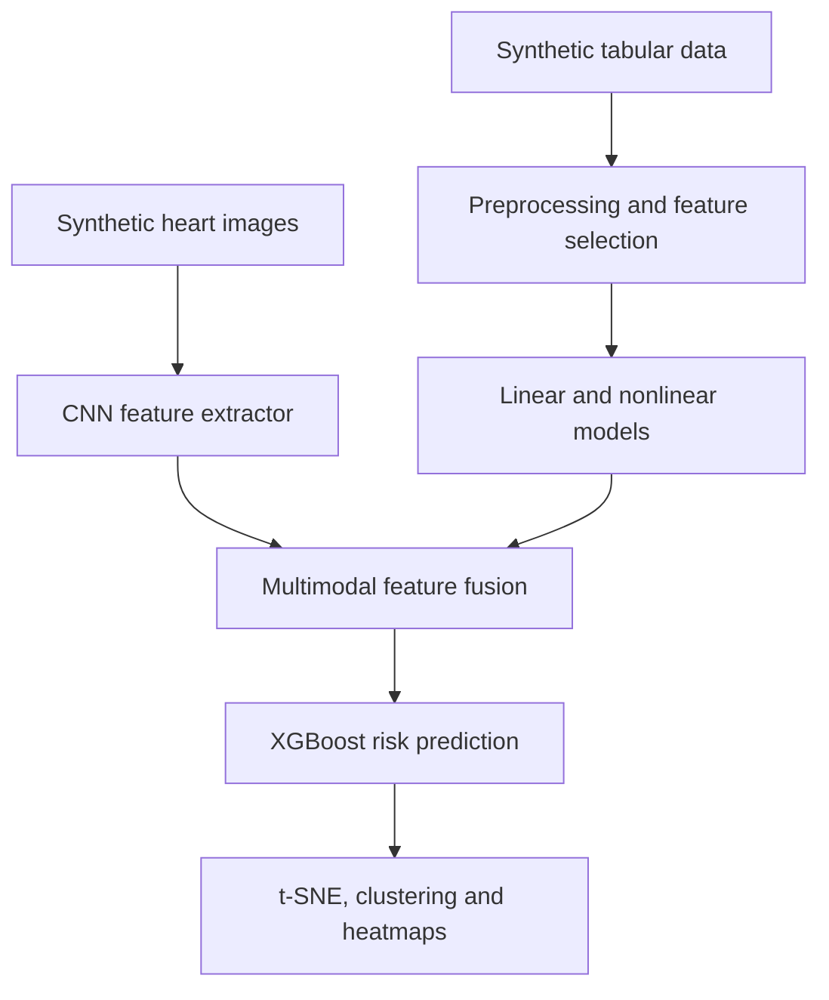

# Multimodal Heart-Failure Risk Prediction

A complete machine-learning pipeline for predicting ten-year heart-failure risk in a fictional Smurf population using structured clinical and lifestyle variables together with synthetic 28 x 28 heart-scan images.

> **Dataset note:** this is a synthetic academic dataset involving fictional characters. It contains no real patients and the results are not medical advice.

**[Read the complete project report](report.pdf)**

## Project objective

The project progressively improves a baseline risk-prediction system and investigates which variables characterize high-risk groups. It combines classical statistics, nonlinear machine learning, computer vision and unsupervised exploration.

## End-to-end workflow



## Dataset

The supplied archive contains 2,005 files:

- 1,000 labeled training observations;
- 500 labeled test observations;
- 500 unlabeled observations;
- one 28 x 28 heart image per observation;
- 13 tabular variables plus the image filename;
- continuous ten-year heart-failure risk targets for the labeled samples.

The tabular features cover age, blood pressure, calcium, cholesterol, hemoglobin, height, potassium, profession, sarsaparilla consumption, smurfberry-liquor consumption, smurfin-donut consumption, vitamin D and weight.

## Methods

### 1. Linear modelling

- duplicate and missing-value checks;
- outlier analysis using Z-scores and IQR;
- one-hot encoding and feature scaling;
- correlation, mutual information, forward/backward selection and LASSO;
- Linear Regression, Ridge, LASSO and Elastic Net;
- 5-fold cross-validation, hold-out validation, AIC, BIC, RMSE and R2.

### 2. Nonlinear modelling

- feature selection using Random Forest and XGBoost importance, RFE and mutual information;
- hyperparameter search with cross-validation;
- Random Forest, XGBoost, RBF-SVR and multilayer perceptron comparison.

### 3. Image and multimodal learning

- grayscale normalization and resizing to 48 x 48;
- a lightweight PyTorch CNN with three convolutional blocks;
- 64-dimensional image embeddings;
- standardized fusion of CNN embeddings and selected tabular features;
- XGBoost prediction on the combined representation.

### 4. Risk-group exploration

- t-SNE visualization;
- Gaussian-mixture clustering into low-, medium- and high-risk groups;
- comparison of physiological profiles;
- Grad-CAM-like heatmaps for image interpretation.

## Main results

| Model | Test RMSE | Test R2 |
|---|---:|---:|
| Ridge linear model | 0.05069 | 0.4854 |
| XGBoost, tabular only | 0.04347 | 0.7196 |
| XGBoost + CNN image features | **0.02951** | **0.87084** |

The multimodal model reduced test RMSE by 32.2% relative to tabular XGBoost and increased test R2 by 15.12 percentage points. Within this synthetic setting, high-risk groups were characterized mainly by higher blood pressure, cholesterol and body weight.

## Repository structure

```text
portfolio/multimodal-heart-risk/
├── README.md
├── code_group_53.ipynb
├── LELEC2870.zip
├── report.pdf
└── requirements.txt
```

- `code_group_53.ipynb` preserves the original analysis; only machine-specific paths were made portable and two saved error tracebacks were removed.
- `LELEC2870.zip` preserves the complete original submission archive, including the supplied synthetic data.
- `report.pdf` is the original six-page group report.

## Reproduce the analysis

Requires Python 3.10 or later.

```bash
python -m venv .venv
source .venv/bin/activate
pip install -r requirements.txt
unzip LELEC2870.zip
jupyter lab code_group_53.ipynb
```

On Windows PowerShell, activate the environment with `.venv\Scripts\Activate.ps1`. The full CNN training workflow can take considerably longer than the tabular experiments and benefits from a GPU.

## Authors

- Yassine Zeamari
- Rajet Jebri

Academic group project for LELEC2870 - Machine Learning, UCLouvain, 2025.
