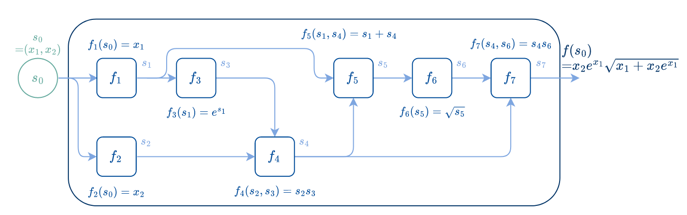

# Vectorized automatic differentiation and transformers in Julia

Portfolio project for **LINMA2472 — Algorithms in Data Science**. The work implements vectorized reverse-mode automatic differentiation, forward-over-reverse Hessian–vector products, optimization experiments, and a small character-level transformer trained on Shakespeare text.

## Highlights

- Tensor-aware reverse-mode AD with broadcasting and matrix operations
- Hessian–vector products without explicitly materializing the full Hessian
- Gradient-descent and Newton-CG experiments
- Character-level transformer experiments on Tiny Shakespeare
- Reproducible benchmark and result slides

The accompanying [results presentation](results_presentation.pptx) reports substantial speed and memory improvements for vectorized reverse mode over scalar forward mode in the tested configurations, including gradient speedups from about **145× to 2,041×**. It also compares gradient descent with Newton-CG on regression and classification tasks. These are reported experimental results from the submitted project; they were not rerun during portfolio packaging.



## Run

Requires Julia.

```bash
julia --project=. -e 'using Pkg; Pkg.instantiate()'
julia --project=. benchmark.jl
julia --project=. testtransformer.jl
```

`testtransformer.jl` offers basic transformer tests and Shakespeare text generation. The dataset is included as `shakespeare.txt`.

## Main files

- `reverse_vectorized.jl`: vectorized reverse-mode AD and Hessian–vector products
- `benchmark.jl`: gradient, HVP, and optimizer benchmarks
- `transformer.jl`: multi-layer transformer implementation
- `transformer_single_layer.jl`: compact single-layer variant
- `testtransformer.jl`: tests and character-generation experiment
- `results_presentation.pptx`: experimental results and interpretation
- `shakespeare.txt`: Tiny Shakespeare corpus used by the experiment

## Authors

- Yassine Zeamari
- Gauthier Viseur
- Mehdi Mannane

## Course attribution and license

This project was completed from the LINMA2472 course assignment and supporting material by **Benoît Legat**. Course-derived code and this published project are provided under the MIT License; see [LICENSE](LICENSE).

Assignment statement: [LINMA2472 HomeworkAD](https://github.com/blegat/LINMA2472/blob/main/HomeworkAD/README.md).

The Shakespeare corpus is redistributed for this educational experiment. See [DATA_NOTICE.md](DATA_NOTICE.md) for its source and attribution.

## Packaging note

The portfolio copy removes redundant lab/reference files and fixes filename casing plus missing dependency declarations for portability. A Julia runtime was unavailable in the packaging environment, so the code received static checks but was not executed there.
