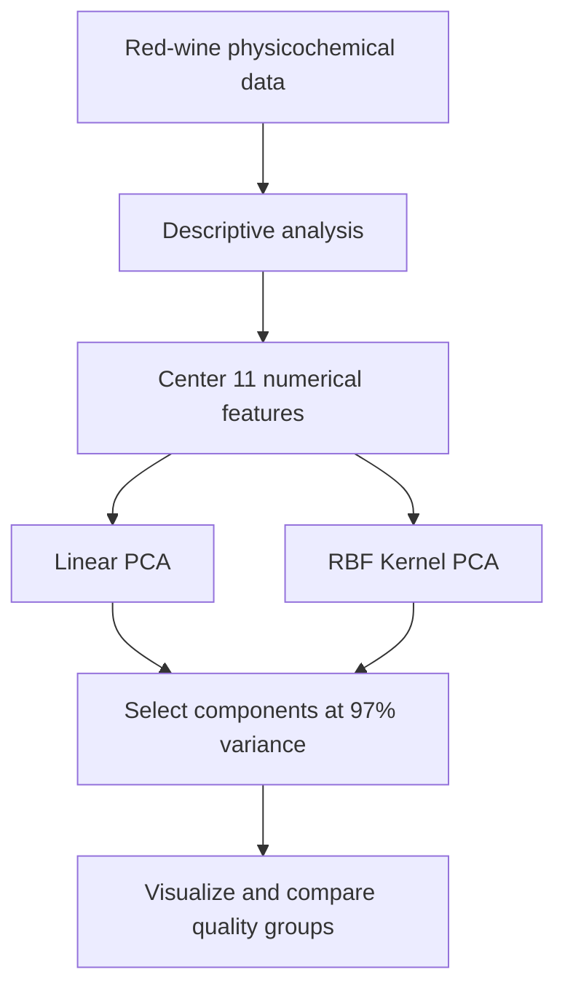

# Wine Quality: PCA and Kernel PCA

An unsupervised learning project comparing linear Principal Component Analysis (PCA) with nonlinear Kernel PCA (KPCA) on physicochemical measurements of Portuguese red wines.

**[Read the complete project report](report.pdf)**

## Research objective

The analysis investigates whether dimensionality-reduction methods can reveal structure associated with wine quality ratings. It asks two related questions:

1. How many components are needed to preserve at least 97% of the observed variance?
2. Does a nonlinear RBF-kernel representation organize the wine-quality groups more clearly than linear PCA?

The published dataset contains 1,599 observations, 11 numerical physicochemical predictors and an ordinal quality score. The original coursework analysis uses the first 500 observations.

## Analysis workflow



## Variables

| Variable | Description |
|---|---|
| Fixed acidity | Concentration of non-volatile acids |
| Volatile acidity | Acetic-acid-related volatile acidity |
| Citric acid | Citric acid concentration |
| Residual sugar | Sugar remaining after fermentation |
| Chlorides | Salt concentration |
| Free sulfur dioxide | Free SO2 concentration |
| Total sulfur dioxide | Total SO2 concentration |
| Density | Wine density |
| pH | Acidity/alkalinity measure |
| Sulphates | Sulphate concentration |
| Alcohol | Alcohol percentage |
| Quality | Sensory quality score from 3 to 8 |

## Methods

### Linear PCA

The feature matrix is centered, its covariance matrix is computed manually, and an eigendecomposition produces principal directions. The smallest number of components reaching 97% cumulative explained variance is retained.

### Kernel PCA

An RBF kernel with `sigma = 0.0001` maps the observations implicitly into a nonlinear feature space. The centered kernel matrix is decomposed, the eigenvectors are normalized, and the observations are projected onto the leading kernel components.

## Main findings

- Linear PCA reaches the 97% variance threshold with two components in the reported analysis.
- The first two linear components capture substantial variance but do not clearly separate the wine-quality groups.
- Kernel PCA reaches approximately 97.3% cumulative variance with three components.
- The nonlinear projection reveals a curved structure and a quality gradient, although the quality classes still overlap.
- Kernel PCA provides a richer representation for exploring nonlinear relationships, while linear PCA remains simpler for compact dimension reduction.

These are exploratory unsupervised findings; they do not constitute a predictive evaluation of wine quality.

## Repository structure

```text
portfolio/wine-quality-pca-kpca/
├── data/
│   └── winequality-red.csv
├── README.md
├── analysis.R
├── install_packages.R
└── report.pdf
```

- `analysis.R` preserves the original coursework analysis.
- `report.pdf` is the original ten-page report with the student identification number removed.
- `data/winequality-red.csv` contains the complete public red-wine dataset.

## Reproduce the analysis

Requires R 4.2 or later.

```r
source("install_packages.R")
source("analysis.R")
```

Run these commands from the project directory. The analysis reads `data/winequality-red.csv` and produces descriptive boxplots, explained-variance curves, linear PCA projections and nonlinear KPCA visualizations.

## Data source

The data come from the [UCI Wine Quality dataset](https://archive.ics.uci.edu/dataset/186/wine+quality), introduced by P. Cortez, A. Cerdeira, F. Almeida, T. Matos and J. Reis (2009), *Modeling wine preferences by data mining from physicochemical properties*.

## Skills demonstrated

R, exploratory data analysis, dimensionality reduction, linear algebra, covariance eigendecomposition, PCA, kernel methods, RBF Kernel PCA, data visualization and interpretation.

## Author

Yassine Zeamari

Individual academic project for LDATS2470, UCLouvain, 2024-2025.
